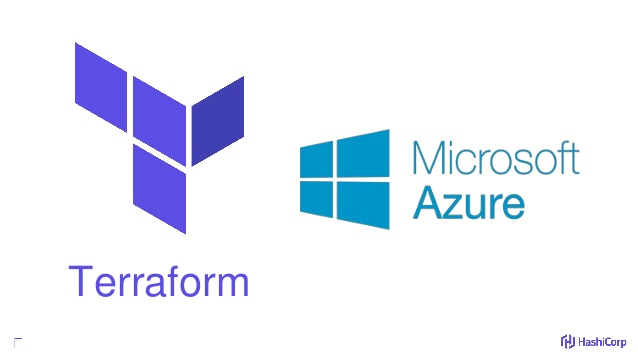

# Terraform on Azure Workshop

This workshop is intended to introduce participants to Terraform on Azure, and give them some basic skills to be able to provision new infrastructure on their own. The slide deck for this workshop is formatted in Markdown and can be found in the `docs` directory. You can simply open index.html in a web browser and use the arrow keys to move through the slide deck. The letters `P` and `C` toggle presenter mode and external mode.

The `challenges` directory contains a series of self-contained labs that you may work through, depending on how much time is allotted for the workshop. For a half day workshop we recommend going through Labs 00, 01, 02, and 06.